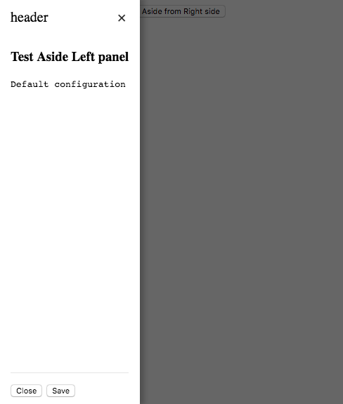
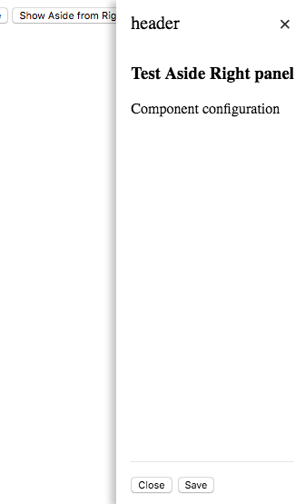
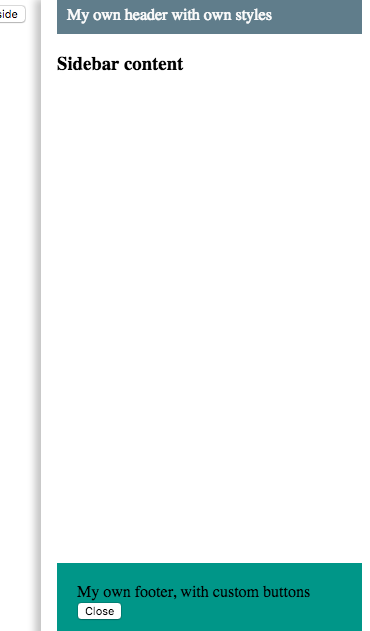

# NgxAside

Angular Aside Component. Simple Angular Sidebar Panel.
  
<hr>

[Live Demo](https://embed.plnkr.co/yEIYsIGLIf8MGYOC2h25/)

<hr>

# Installation

```shell
npm install --save ngx-aside
```
# Usage

```TypeScript
//app.module.ts
import { NgxAsideModule } from 'ngx-aside';

@NgModule({
    imports: [NgxAsideModule]
    })
```

```Html
<ngx-aside #NgxAsidePanelRight
           (cancel)="onCancel()"
           (submit)="onSave()"
           [title]="Title"
           [closeOnEscape]="false"
           [showOverlay]="false"
           [showDefaultFooter]="true"
           [showDefaultHeader]="true">
           
<button (click)="NgxAsidePanelLeft.show()">Show Sidebar panel</button>

```


You can disable default header and footer of panel
```Html    
    [showDefaultFooter]="false"
    [showDefaultHeader]="false"
```


Add custom header and footer to the panel
```Html
    <ngx-aside #NgxAsidePanelRight
               [showDefaultFooter]="false"
               [showDefaultHeader]="false">
    
        <header>My own header with own styles</header>
        
    
        <footer>
            My own footer, with custom buttons
            <button (click)="NgxAsidePanelRight.hide()">
                Close
            </button>
        </footer>
    
    </ngx-aside>

```
# Screenshots

[Live Demo](https://embed.plnkr.co/yEIYsIGLIf8MGYOC2h25/)
<br/>

 Position left |  Position right
 ------------ | -------------
 | 
<br/>Custom header and footer |  
 |


## Install demo application
Run `npm install` for install all dependencies.

## Start demo application
Run `ng serve` for a dev server. Navigate to `http://localhost:4200/`. 


## Running unit tests

Run `ng test` to execute the unit tests via [Karma].

This project was generated with [Angular CLI](https://github.com/angular/angular-cli) version 1.0.0-rc.0.